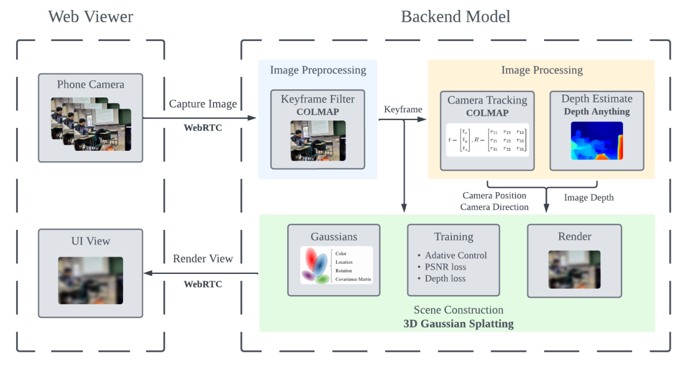

# 3d gaussian splatting slam

## 研究動機
三維場景重建是計算機視覺領域中一項重要的演算法，透過各種感測技術建構出逼真的三維數位模型，其目標是能夠以高精度和細節還原現實場景。應用於虛擬現實（VR）、增強現實（AR）、電腦遊戲、以及自動駕駛等多個領域。

3D Gaussian Splatting 是一種新興的技術，通過使用高斯點群來表示三維場景中的物體。本組計畫利用 3D Gaussian Splatting 對於重建場景品質與效率上的優勢，設計一套簡易使用的三維場景重建工具，透過手機與一般家用電腦就能夠體驗場景重建技術。

## 系統架構
### 前端(Web Viewer)
  - 連接裝置上的相機拍攝相片
  - 接收後端的成果預覽
### 後端(Backend Model)
  - COLMAP 進行特徵點萃取以及相機位置預測
  - Depth Anything 進行場景深度預測
  - 3D Gaussian Splatting 進行場景建立、渲染、訓練

### 流程
1. 使用者連上系統後開始錄製
2. 使用COLMAP與Depth Anything將影像預處理，將模糊(特徵點過少)的影格刪除
3. 啟動3D Gaussian Splatting 利用過濾好的資料集訓練，同時將過程中的半成品串流至前端顯示
4. 訓練完畢3D Gaussian Splatting轉換成預覽模式。前端透過操作UI移動視角，並由後端渲染後傳回顯示



## References
1. Bernhard Kerbl et al. 3D Gaussian Splatting for Real-Time Radiance Field Rendering. 2023. arXiv: 2308.04079 [cs.GR]. URL: https://arxiv.org/abs/2308.04079.

2. Ben Mildenhall et al. NeRF: Representing Scenes as Neural Radiance Fields for View Synthesis. 2020. arXiv: 2003.08934 [cs.CV]. URL: https://arxiv.org/abs/2003.08934.

3. Johannes Lutz Schönberger and Jan-Michael Frahm. “Structure-from-Motion Revisited”. In:Conference on Computer Vision and Pattern Recognition (CVPR). 2016.

4. Lihe Yang et al. Depth Anything: Unleashing the Power of Large-Scale Unlabeled Data. 2024. arXiv: 2401.10891 [cs.CV]. URL: https://arxiv.org/abs/2401.10891.

5. https://github.com/WangFeng18/3d-gaussian-splatting

6. https://github.com/luigifreda/pyslam

7. https://github.com/LiheYoung/Depth-Anything


## Testing
test splatter render

```bash
git clone git@github.com:colmap/colmap.git
docker build  -t 3dgs_slam:0.1.0 .
docker run -it --rm -e  "DISPLAY=$DISPLAY" -v /tmp/.X11-unix:/tmp/.X11-unix -v ./:/app --privileged --gpus all 3dgs_slam:0.1.0 bash
python3 src/gaussian_cuda/setup.py install
export PYTHONPATH="${PYTHONPATH}:/app/src"
python3 src/splatting/splatter.py
python3 -m src.splatting.trainer
```

docker compose

```bash
git clone git@github.com:colmap/colmap.git
docker-compose up -d
docker exec -it 3dgs_slam bash

export PYTHONPATH="${PYTHONPATH}:/app/src"
python3 -m src.splatting.trainer
python3 src/main.py
```
